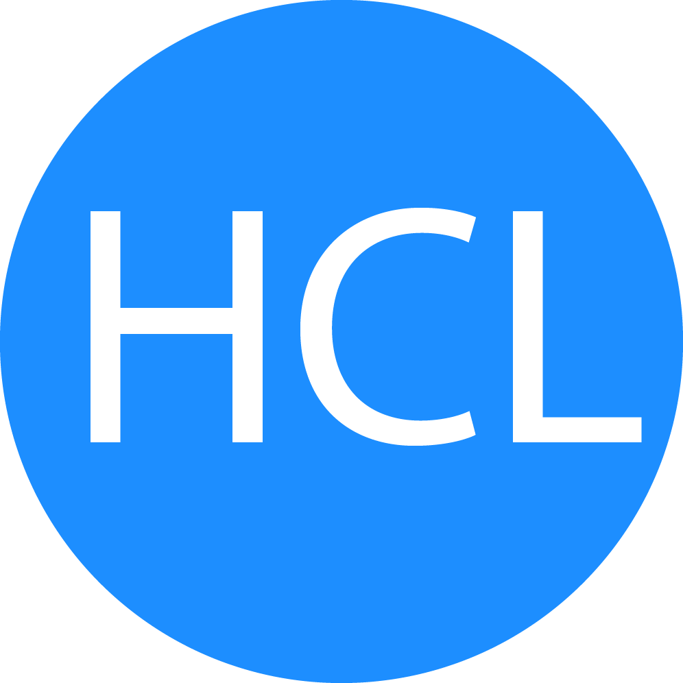

# HCL DNA Learning Path Repository
Evan Watson
## Purpose
This repository is meant to hold all work Evan Watson has completed while he participates in HCL's DNA courses.

## File Structure
### Assignments Folder
- Lab Assignments
### Practice
- Code we learn in class and personal testing purposes
### Resources
- Holds any additional files, such as images